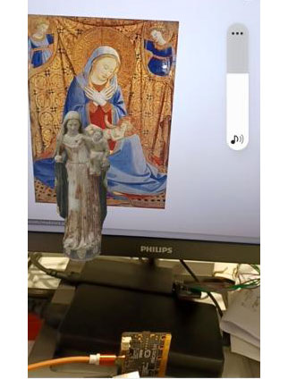

# Mother Mary AR App #01 

## How to Use:

This augmented reality (AR) app expects you to scan the following target image using your phone or computer's camera.

Once you've successfully scanned the image, it displays a 3D model of Our Lady of Besalú. This gothic sculpture of the Virgin Mary is kept at the <a href="https://museuart.cat/">Girona Art Museum</a>.

## AR Outputs:

Here are sample views of the 3D model when scanned by the app:

    

## Try It Out:

Scan the QR code or click the link below to open the app, then use the app to scan the image of Our Lady of Besalú on the right.

  
   

<a href="https://jennylimhk.github.io/mamaMary01/">Live demo</a>

Built With:

- <a href="https://hiukim.github.io/mind-ar-js-doc/">MindAR</a>: open source Web AR library
- <a href="https://aframe.io">A-Frame</a>: web framework for building 3D/AR/VR experiences

Attribution:

- <a href="https://sketchfab.com/3d-models/marededeu-de-besalu-mda-dbb2024df8af48589950906ccf023904">Marededeu de Besalú, Md'A</a> by <a href="https://patrimoni.gencat.cat/giravolt">Giravolt</a> is licensed under <a href="https://creativecommons.org/licenses/by/4.0/">CC 4.0</a> 

- <a href="https://upload.wikimedia.org/wikipedia/commons/thumb/3/32/Angelico%2C_madonna_dell%27umilt%C3%A0_washington.jpg/800px-Angelico%2C_madonna_dell%27umilt%C3%A0_washington.jpg">The Madonna of Humility</a> by <a href="https://en.wikipedia.org/wiki/Fra_Angelico">Fra Angelico</a> is licensed under <a href="https://creativecommons.org/publicdomain/zero/1.0/">Creative Commons CC0 License</a>