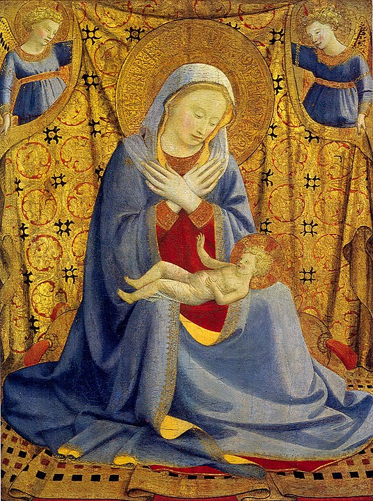
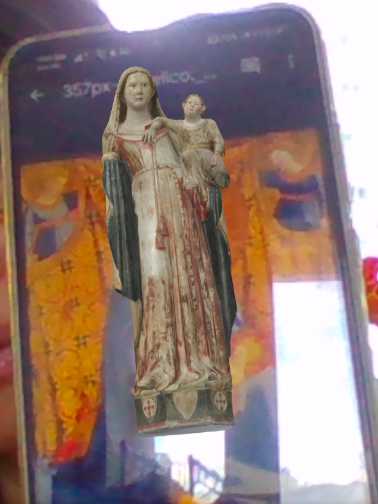
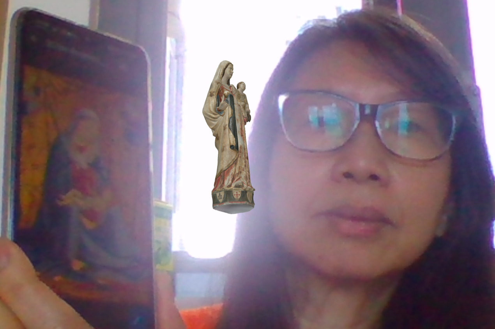
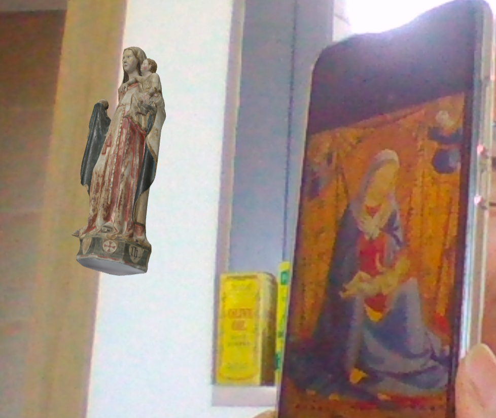

# mamaMary01

This AR app expects you to scan the following target image using your phone or computer's camera.

Once you've successfully scanned the image, it displays a 3D model of Our Lady of Besalú, "a piece sculpted from alabaster and polychromed, is one of the most notable gothic sculptures of the Virgin Mary kept at the Girona Art Museum".

Here are sample views of the 3D model when scanned by the app:

Attribution:

- <a href="https://sketchfab.com/3d-models/marededeu-de-besalu-mda-dbb2024df8af48589950906ccf023904">Marededeu de Besalú, Md'A</a> by <a href="https://patrimoni.gencat.cat/giravolt">Giravolt</a> is licensed under <a href="https://creativecommons.org/licenses/by/4.0/">CC 4.0</a> 

- <a href="https://upload.wikimedia.org/wikipedia/commons/thumb/3/32/Angelico%2C_madonna_dell%27umilt%C3%A0_washington.jpg/800px-Angelico%2C_madonna_dell%27umilt%C3%A0_washington.jpg">The Madonna of Humility</a> by <a href="https://en.wikipedia.org/wiki/Fra_Angelico">Fra Angelico</a> is licensed under <a href="https://creativecommons.org/publicdomain/zero/1.0/">Creative Commons CC0 License</a>